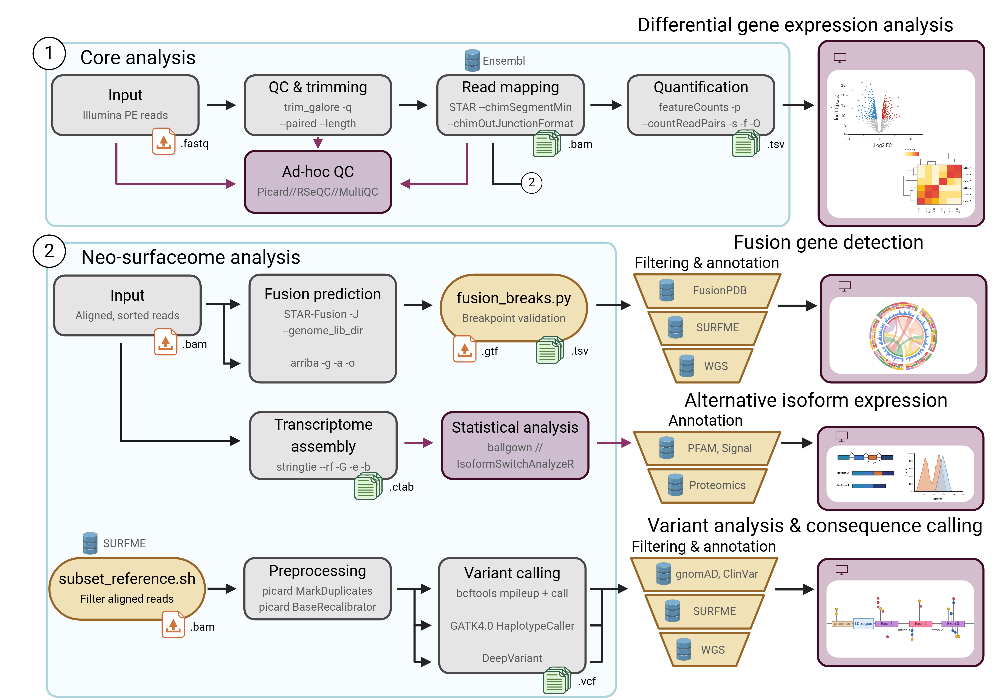
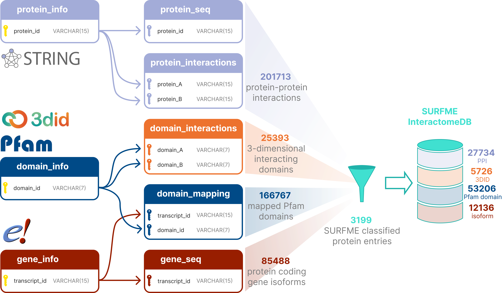
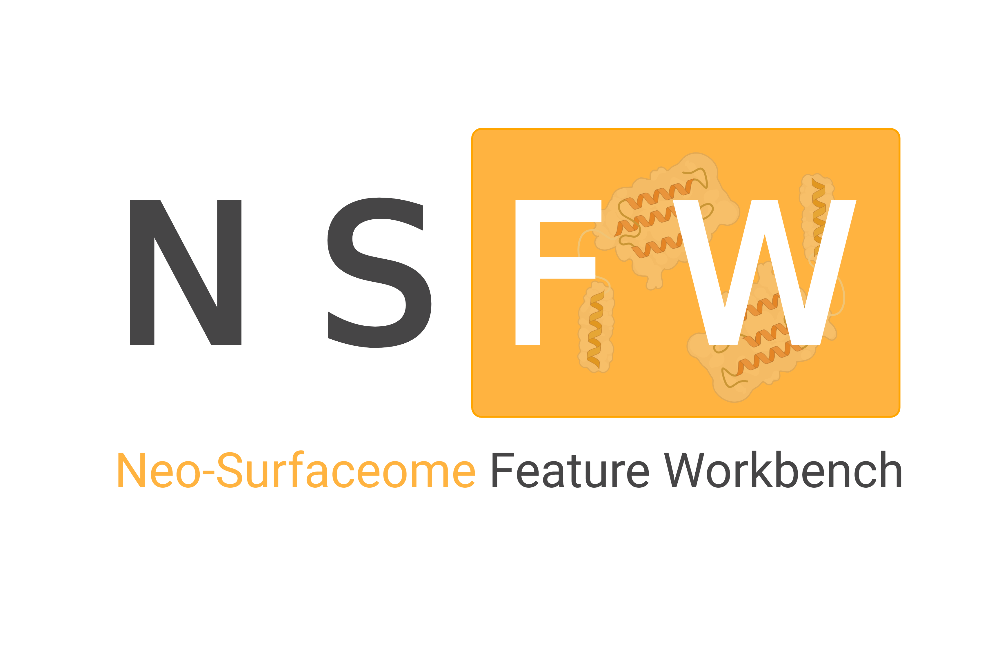

# Integrative Multi-Omics Analysis of Glioblastoma cell-surface neo-antigens

*Master's thesis project done under the supervision of Mattias Belting at the Tumor Microenvironment Research Group at Lund University*

- [Integrative Multi-Omics Analysis of Glioblastoma cell-surface neo-antigens](#integrative-multi-omics-analysis-of-glioblastoma-cell-surface-neo-antigens)
  - [1. Introduction](#1-introduction)
    - [1.1. Project aims](#11-project-aims)
  - [2. Setting Up the Environment](#2-setting-up-the-environment)
    - [2.1. Directory tree](#21-directory-tree)
    - [2.2. HPC Environment Prerequisits](#22-hpc-environment-prerequisits)  
  - [3. Pipeline Input](#3-pipeline-input)
- [Bioinformatical pipeline](#bioinformatical-pipeline)
- [SURFME Interactome DB](#surfme-interactome-db)
- [NSFW, Neo-Surfaceome Feature Workbench](#nsfw-neo-surfaceome-feature-workbench)

## 1. Introduction

> [!NOTE]
> *This section provide a brief overview of the biological background relevant to the research project and explain the biological problem being addressed, its significance in the field, and a summary of the approach or hypothesis being tested.*

Glioblastoma (GBM) is the most common and one of the most aggressive forms of primary malignant brain tumour. The current therapeutic strategy *i.e., surgical resection and radio-chemotherapy* does not significantly prolong patient survival ([Alexender BM & Cloughesy TF, 2017](https://doi.org/10.1200/JCO.2017.73.0119),[Louis DN et al., 2021](https://doi.org/10.1093/neuonc/noab106)). Despite extensive genomic and transcriptomic profiling ([Brennan CW et al., 2013](https://doi.org/10.1016/j.cell.2013.09.034), [Verhaak RGW et al., 2010](https://doi.org/10.1016/j.ccr.2009.12.020)), actionable surface antigens for targeted immunotherapies remain elusive due to GBM’s high heterogeneity, immunosuppressive microenvironment, and limitations set by the blood-brain barrier.

Multiple first- and second-generation tyrosine kinase inhibitors (TKIs) have been tested targeting driver genes (*e.g. EGFR*). However, despite their well-established efficacy in other cancer types, trials have failed to demonstrate significant benefit in recurrent GBM. Early trials with monoclonal antibodies (mAbs) and immune checkpoint inhibitors (ICIs) have also been evaluated in GBM with limited success [(Obrador E et al., 2024)](https://doi.org/10.3390/ijms25052529). Promising, new treatment modalities in oncology, including anti-body-drug conjugates and CAR-T cells, all target the tumor cell surfaceome [(Lui Y et al., 2024)](https://doi.org/10.1038/s41423-024-01226-x). To systematically identify novel therapeutic vulnerabilities in GBM, our research group developed TS-MAP, a platform for unbiased mapping of the tumor surfaceome and endocytome [(Governa V et al., 2022)](https://doi.org/10.1073/pnas.2114456119).

In this study, we present an integrated multi-omics framework for the discovery of tumor-specific surface antigens, collectively termed the neo-surfaceome, arising from somatic single-nucleotide variants, fusion transcripts, and aberrant splicing events. We integrate matched data layers from RNA sequencing (RNA-seq), whole-genom sequencing (WGS) and proteomics, to counteract a previously discovered key limitation, that the transcriptomic and proteomic data exhibit only limited correlation [(de Oliveira KG et al., 2024)](https://doi.org/10.1186/s40478-024-01740-z). Over the course of two previous research projects, I have developed a bioinformatics pipeline to process RNA-seq data, laying the groundwork for incorporating additional omics layers (*Figure 1*).



### 1.1. Project aims

In this project, we aimed to make our entire neo-surfaceome discovery framework – encompassing data processing, analysis, and visualization – as containerized and modular as possible.
First, we aimed to finalize and optimize a bioinformatics pipeline and to enhance reproducibility and scalability, we migrated the pipeline to Nextflow, which architecture supported seamless process parallelization and enabled a 25-fold reduction in runtime compared to the previous serial execution. Then, to contextualize the functional impact of mutations on protein–protein interactions, we also developed the **SURFME Interactome DB** database with structurally supported domain–domain interactions. Finally, to visualize and explore the results, we developed the **Neo-Surfaceome Feature Workbench (NSFW)**, a proof-of-concept graphical interface built in R Shiny and containerized using Docker. The visualization app interacts with the MySQL-based database enabling real-time exploration, and can be deployed alongside it using a lightweight Docker Compose setup. 

## 2. Setting Up the Environment
>[!NOTE]
> *To conduct the computational analyses required for this project, it's crucial to set up a consistent and reproducible environment. This section provides a guide through the process of setting up the computational environment: library tree, software dependencies and creating a virtual environment.*

### 2.1. Directory Tree
```bash
.
├── database
│   ├── benchmark
│   ├── data
│   ├── etc
│   └── scripts
├── meta
├── CTAT-genome-lib
│   ├── ref_genome.star.idx
│   └── ref_genome.salmon.idx
├── nextflow
│   ├── modules
│   └── subworkflows
├── rawdata
├── results
│   ├── 00_report
│   ├── 01_trim
│   ├── 02_quant
│   ├── 03_align
│   ├── 04_fusion
│   └── 05_snv
└── shiny-app
    ├── meta
    └── www
```
### 2.2. HPC Environment Prerequisits

The sensitive nature of the patient tumor data makes it a requirement to work on the protected high-performance computing cluster of Uppmax (Uppsala Multidisciplinary Center for Advanced Computational Science), [BIANCA](https://www.uppmax.uu.se/resources/systems/the-bianca-cluster/). BIANCA is specifically designed for sensitive data providing a secure environment. It operates under strict access control, including two-factor authorization, connection only from a SUNET Internet Protocol ('IP') address, no direct web access, rather using an sftp port for up- and downloading data. These features ensure compliance with data protection regulations while handling and processing data that is subject to legal and ethical restrictions, e.g. the patient total RNA-seq and genome sequence date used in our research.

In order to access Bianca, an account is needed both for the Swedish User and Project Repository (SUPR) with the university portal (SWAMID) and for Uppmax. The user needs to join a SENS project and set up a two-factor authentication via their Uppmax account.

For security reasons, the hundreds of virtual project clusters on BIANCA are isolated from each other and the Internet. This makes file transfer to the server a little complicated: all files must be transfered through the wharf area of Bianca, that has access only to one project folder, named `<username>-<projid>` but nothing outside of it. The data transfer is executed using standard sftp protocol:
```bash
$ sftp -q <username>-<projid>@bianca-sftp.uppmax.uu.se:<username>-<projid>
```
The window will change to an SFTP environment, where bulk upload can be executed via the `mput`, bulk download via the `mget`commands.
```bash
sftp> mput -r <path/…/local_dir/> <path/…/remote_dir>
```
>[!IMPORTANT]
>***To avoid subtle error with the transfers, make sure you have write permissions for "owner" on the source files and directories. Furthermore, `sfpt put` cannot create directories, only use pre-existing one, so make sure that directories with matching names to the ones you want to copy are created in the remote folder prior to the transfer!*** 

Finally, UPPMAX is a shared resource, and it uses a sceduling system - called SLURM - to ensure fair allocation. Furthermore, it uses Environment Modules tool that simplifies shell initialization and lets users easily modify their environment during a session using modulefiles. The developed pipeline uses a 'profile' specifically designed for work on UPPMAX, that provides built-in scheduler support and module system support. :paperclip: [More information...](nextflow/README.md#2-nextflow-configuration) 

## 3. Pipeline Input

>[!NOTE]
> *This section provides a summary of the sample metadata used as the main input source to the data processing nextflow pipeline.*

The names of the samples as well as the paths to the forward and reverse reads were collected in the "meta/samples.csv" file using the `getSamples.sh` script.

```bash
# Create the samples.tsv file if it does not exist
if [ ! -f "$output_dir/${config_file}" ]
then    
  echo -e "sample,read1,read2" > "$output_dir/${config_file}"
  # Loop through the files in the input directory
  samples=$(ls -d ${input_dir}Sample_*)
  while read -r sample
  do
    echo "Processing sample: $sample"
	  name=$(basename $sample)
	  name=$(sed 's/Sample_//g' <<< ${name})
    fw_read=$(ls ${sample}/*_R1_001.fastq.gz)
    rv_read=$(ls ${sample}/*_R2_001.fastq.gz)

    echo -e "$name,$fw_read,$rv_read" >> "$output_dir/${config_file}"
  done <<< "$samples"
fi
```

# Bioinformatical pipeline 

>[!NOTE]
> *Following the link at the end of this section a detailed description of the data processing nextflow pipeline is available...*

The revised pipeline is organized into four coordinated sub-workflows: (i) isoform-level quantification, (ii) genome-guided alignment, (iii) variant calling, and (iv) fusion detection. The core execution path – comprising trim-galore, STAR alignment, Picard preprocessing, and variant calling using BCFtools – builds sequentially, while all other steps execute concurrently, taking full advantage of process-level parallelism (*Figure 2*). :paperclip: [More information...](nextflow/README.md#2-workflow)

 undergo trimming, quantification, alignment, fusion-detection and variant calling steps.")

# SURFME Interactome DB

>[!NOTE]
> *Following the link at the end of this section a detailed description of the complementary MySQL database is available...*

To contextualize the functional impact of mutations on protein–protein interactions, we also developed the SURFME Interactome DB database with 3D domain interaction supported protein-protein interactions, based on the work of [Kharaman *et al.* (2020)](https://doi.org/10.1038/s41598-020-71221-5). Briefly, annotation and sequence data of protein-coding isoforms from Ensembl (v103), corresponding Pfam domain annotations, STRING PPI partners were processes, along with physically interacting Pfam domains based on the 3did database. Additionally, to focus our resource on clinically actionable surface targets, we can apply a filter using the previously published SURFME catalogue from our laboratory, which includes 3,317 *bona fide* tumor-associated surface proteins. The filtered database contains 12,136 unique surface protein isoforms annotated with 53,206 Pfam domains, participating in 27,734 PPIs and 5,726 DDIs (*Figure 3*). :paperclip: [More information...](database/README.md)



>[!IMPORTANT]
> ***The Ensembl and Pfam resources were already provided in the "CTAT-genome-lib" reference, that we used for the data processing as well. In practice, we require only one of the affected fusion- or interaction partners to be classified as a SURFME protein!***

# NSFW, Neo-Surfaceome Feature Workbench



A proof-of-concept graphical interface built in R Shiny and containerized using Docker. The visualization app interacts with the MySQL-based (***SURFME Interactome DB***) surfaceome database and can be deployed alongside it using a lightweight Docker Compose setup. :paperclip: [More information...](shiny-app/README.md)
