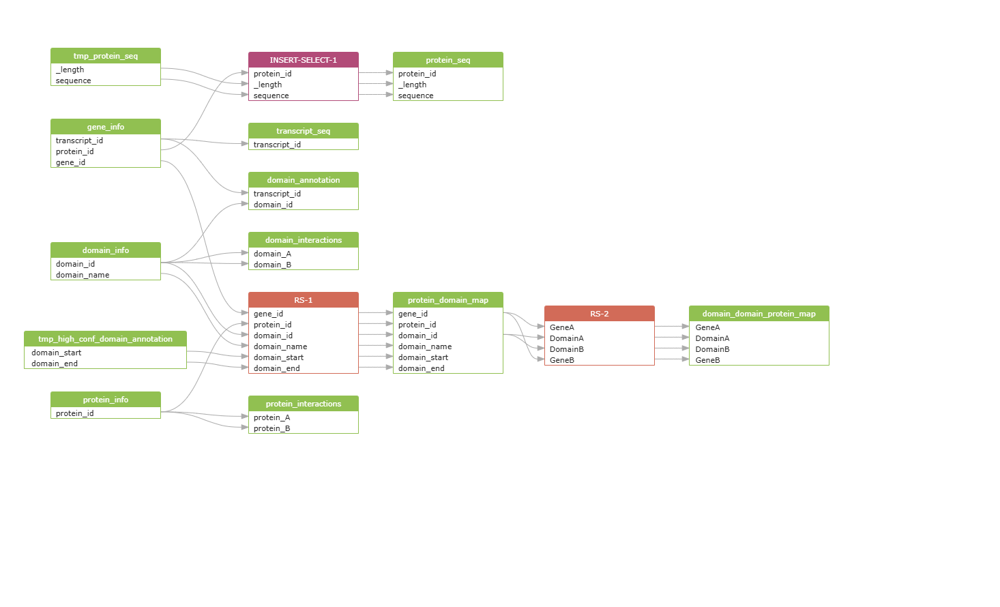

# Surface Protein Interaction Database

- [Surface Protein Interaction Database](#surface-protein-interaction-database)
  - [1. Download and Parse Data](#1-download-and-parse-data)
  - [2. Database initialization](#2-database-initialization)
  - [3. Query optimization](#3-query-optimization)

We have developed the SURFME Interactome DB database inspired by, and based on the work of [Kharaman *et al.* (2020)](https://doi.org/10.1038/s41598-020-71221-5), and their source code shared in their GitHub repository - [CanIsoNet](https://github.com/abxka/CanIsoNet).

# 1. Download and Parse Data

Some of the data, namely the annotation and sequence data of protein-coding isoforms from Ensembl (v103), and the corresponding Pfam domain annotations, were already included in the CTAT genome library, thus these files were not donwloaded again. The rest of the database files were downloaded from the corresponding `ftp://` sites using `wget`, then parsed to a matching tidy, tab-delimited format retaining only the columns of interest.

### [GENCODEv37](https://www.gencodegenes.org/human/release_37.html) - `scripts/prep_gtf.py`

We processed the `.gtf` reference genome annotation from the CTAT genome library folder, using a custom python script, to extract the `transcript_id`, `chromosome`, `start`, `end`, `strand`, `length`, `ttranscript_type`, `protein_id`, `gene_id`, `gene_symbol`, and `hgnc_symbol` fields and parse them into a tab-delimited output file:

```python
def parse_gtf(gtf_file, output_tsv):
    """
    Parses the Ensembl GTF file and extracts transcript ID, chromosome, start, end, strand, length,
    transcript type, protein ID, gene ID, gene symbol, and HGNC symbol.
    """
    try:
        with open(gtf_file, 'r') as infile:
            header_lines = [line for line in infile if line.startswith('#')]
            if not header_lines:
                print("Warning: No header found. Ensure the file is a valid GTF format.")
    except FileNotFoundError:
        print(f"Error: File '{gtf_file}' not found.")
        sys.exit(1)
    except Exception as e:
        print(f"Error reading file: {e}")
        sys.exit(1)

    with open(gtf_file, 'r') as infile, open(output_tsv, 'w') as outfile:
        outfile.write("#transcript_id\tchromosome\tstart\tend\tstrand\tlength\ttranscript_type\tprotein_id\tgene_id\tgene_symbol\thgnc_symbol\n")
        for line in infile:
            if line.startswith('#'):
                continue
            fields = line.strip().split('\t')
            if len(fields) < 9 or fields[2] != 'transcript':
                continue

            chrom, start, end, strand, attributes = fields[0], int(fields[3]), int(fields[4]), fields[6], fields[8]
            length = end - start

            # Dictionary-based attribute extraction
            attr_dict = {}
            for attr in attributes.strip().split(';'):
                if attr.strip() == '':
                    continue
                key, val = attr.strip().split(' ', 1)
                attr_dict[key] = val.strip('"')

            # Required fields (some may be missing)
            gene_id = attr_dict.get("gene_id", "NA").split('.')[0]
            transcript_id = attr_dict.get("transcript_id", "NA").split('.')[0]
            transcript_type = attr_dict.get("transcript_type", "NA")
            protein_id = attr_dict.get("protein_id", "NA").split('.')[0] if "protein_id" in attr_dict else "NA"
            gene_symbol = attr_dict.get("gene_name", "NA")
            hgnc_symbol = attr_dict.get("hgnc_id", "NA").replace("HGNC:", "") if "hgnc_id" in attr_dict else "NA"

            outfile.write(f"{transcript_id}\t{chrom}\t{start}\t{end}\t{strand}\t{length}\t{transcript_type}\t{protein_id}\t{gene_id}\t{gene_symbol}\t{hgnc_symbol}\n")

    print(f"Parsing complete. Output saved to {output_tsv}")


if __name__ == "__main__":
    if len(sys.argv) != 3:
        print("Usage: python parse_gtf.py <input.gtf> <output.tsv>")
        sys.exit(1)

    input_gtf = sys.argv[1]
    output_tsv = sys.argv[2]
    parse_gtf(input_gtf, output_tsv)
```

### [Ensembl (release 103)](https://feb2021.archive.ensembl.org/index.html) - `scripts/prep_fasta.py`
We also processed two multi-line `.fasta` files from reference genome annotation: the `ref_annot.cdna.fa` with the nucleotide sequence of every protein-coding transcript (*= canonical isoforms*), and the `ref_annot.pep` with the amino-acid sequence of canonical proteins. We parsed it too, using another custom python script, to extract the transcript ID, chromosome, start, end, strand, length, transcript type, protein ID, gene ID, gene symbol, and HGNC symbol fields and parse them into a tab-delimited output file with 3 columns `protein_ID/transcript_ID`, `length`, and `sequence`:
```python
#!/usr/bin/env python3
# -*- coding: utf-8 -*-
"""
parse_fasta.py - A script to parse a multi-line FASTA file containing coding sequences into a TSV format.
"""

import sys

def parse_fasta(fasta_file, type, output_tsv):
    """
    Parses a multi-line FASTA file and extracts transcript ID, sequence length, and sequence.
    """
    try:
        with open(fasta_file, 'r') as infile:
            lines = infile.readlines()
            if not lines or not lines[0].startswith('>'):
                print("Error: Invalid FASTA format.")
                sys.exit(1)
    except FileNotFoundError:
        print(f"Error: File '{fasta_file}' not found.")
        sys.exit(1)
    except Exception as e:
        print(f"Error reading file: {e}")
        sys.exit(1)

    with open(fasta_file, 'r') as infile, open(output_tsv, 'w') as outfile:
        if type == "protein":
            outfile.write("protein_ID\tlength\tsequence\n")
        elif type == "transcript":
            outfile.write("transcript_ID\tlength\tsequence\n")
        else:
            print("Error: Type must be either 'protein' or 'transcript'.")
            sys.exit(1)
        
        _id = None
        sequence = []
        
        for line in infile:
            line = line.strip()
            if line.startswith('>'):
                if _id and sequence:
                    seq = ''.join(sequence)
                    outfile.write(f"{_id}\t{len(seq)}\t{seq}\n")
                
                parts = line[1:].split()
                _id = parts[0].split('.')[0] if parts else None
                sequence = []
            else:
                sequence.append(line)
        
        if _id and sequence:  # Write last entry
            seq = ''.join(sequence)
            outfile.write(f"{_id}\t{len(seq)}\t{seq}\n")
    
    print(f"Parsing complete. Output saved to {output_tsv}")


if __name__ == "__main__":
    if len(sys.argv) != 4:
        print("Usage: python parse_fasta.py <input.fasta> <type='protein'/'transcript'> <output.tsv>")
        sys.exit(1)
    
    input_fasta = sys.argv[1]
    type = sys.argv[2]
    output_tsv = sys.argv[3]
    parse_fasta(input_fasta, type, output_tsv)
```

### [Pfam](http://pfam.xfam.org/) - `scripts/parse_pfam.py`

A compressed Pfam annotation is also available in the CTAT genome library, created by running [HMMER](http://hmmer.org/)'s hmmscan on the Ensemble reference fasta file, using the current [Pfam HMM library](https://pfam-docs.readthedocs.io/en/latest/ftp-site.html) for Pfam-A families. This file we moved and decompressed in the desired location then parsed to two separate tabulated files: (i) the **domain_annotation.tsv** file with fields: `transcript_id`, `protein_length`, `domain_id`, `domain_length`, `domain_start`, `domain_end`, `accuracy`, `score`, and `E-value`, and (ii) the **domain_info.tsv** file with columns: `domain_id`, `domain_name`, `description`.
```python
#!/usr/bin/env python3
# -*- coding: utf-8 -*-

import sys
import re

def parse_hmmscan_output(input_file, assoc_output, domain_output):
    domain_seen = {}
    
    with open(input_file, 'r') as infile, \
         open(assoc_output, 'w') as assoc_out, \
         open(domain_output, 'w') as domain_out:
        
        # Headers
        assoc_out.write("transcript_id\tprotein_length\tdomain_id\tdomain_length\tdomain_start\tdomain_end\taccuracy\tscore\tE-value\n")
        domain_out.write("domain_id\tdomain_name\tdescription\n")

        for line in infile:
            if line.startswith('#') or line.strip() == '':
                continue
            
            # Split line into tokens, preserve the final field (description)
            parts = re.split(r'\s{1,}', line.strip(), maxsplit=22)
            if len(parts) < 23:
                continue  # skip malformed lines

            domain_name = parts[0]                 # "target name"
            domain_id = parts[1].split('.')[0]     # "accession"
            domain_length = parts[2]               # "tlen"
            transcript_id = parts[3].split('.')[0] # "query name"
            transcript_length = parts[5]           # "qlen"
            e_value = parts[12]                     # "E-value"
            domain_score = parts[13]               # "(this domain) score"
            hmm_start = parts[15]                  # "(hmm coord) from"
            hmm_end = parts[16]                    # "(hmm coord) to"
            acc = parts[21]                        # "acc"
            description = parts[22]                # "description of target"

             # Write to domain table if not seen
            if domain_id not in domain_seen:
                domain_out.write(f"{domain_id}\t{domain_name}\t{description}\n")
                domain_seen[domain_id] = True

            # Write to association table
            assoc_out.write(f"{transcript_id}\t{transcript_length}\t{domain_id}\t{domain_length}\t{hmm_start}\t{hmm_end}\t{acc}\t{domain_score}\t{e_value}\n")

    print(f"Parsing complete.\n- Transcript-domain associations saved to '{assoc_output}'\n- Unique domain records saved to '{domain_output}'.")

if __name__ == "__main__":
    if len(sys.argv) != 4:
        print("Usage: python parse_domains.py <input_file> <assoc_output.tsv> <domain_output.tsv>")
        sys.exit(1)

    parse_hmmscan_output(sys.argv[1], sys.argv[2], sys.argv[3])
```

### [3DID](https://3did.irbbarcelona.org/download/current/) - `scripts/get_3did.sh`

The database of three-dimensional interacting domains (3did) is a collection of high-resolution three-dimensional structural templates for domain-domain interactions.
```bash
# Set up the URL to the current flat file of 3DID
did_url="https://3did.irbbarcelona.org/download/current/"
# Create directory
output_dir="${output}"
mkdir -p ${output_dir}

# Download the flat file from 3DID containing interacting domain pairs (ID) 
FLAT_3DID="3did_flat.gz"
if [ ! -f "${output_dir}${FLAT_3DID}" ] ; then
	get ${did_url}${FLAT_3DID} ${output_dir} || (echo "Error getting ${FLAT_3DID}" && exit 1)
	gunzip ${output_dir}${FLAT_3DID} || (echo "Error unzipping ${FLAT_3DID}" && exit 1)
    mv ${output_dir}${FLAT_3DID%.gz} ${output_dir}${FLAT_3DID%.gz}.dat
else
	echo "${FLAT_3DID%.gz} have been dowloaded already..."
fi
FLAT_3DID="${output_dir}${FLAT_3DID%.gz}.dat"
echo -e "Downloaded interacting domain pairs: ${FLAT_3DID}"
```
The from the file the physically interacting domains' names are extracted and saved in a tabulated file with two columns: `domain_A`, `domain_B`:
```bash
# Create the interaction table
input_file="${FLAT_3DID}"
preprocessed_file="domain_interactions.tsv"
less "$input_file" | grep "^#=ID" | cut -f4,5 | perl -ane '
	BEGIN { print "domain_A\tdomain_B\n" }
    $F[0] =~ s/.*(PF\d+).*/$1/;
    $F[1] =~ s/.*(PF\d+).*/$1/;
    print "$F[0]\t$F[1]\n$F[1]\t$F[0]\n";
' | sort -u > "${output_dir}/${preprocessed_file}"

echo -e "Processed interactions saved to: ${output_dir}/${preprocessed_file}"
rm ${FLAT_3DID} || (echo "Error removing ${FLAT_3DID}" && exit 1)
```

### [STRING](https://stringdb-downloads.org/download/) - `scripts/get_string.sh`

Two files have been downloaded from STRING db (v12), the **detailed protein links** and the **protein info**. Both of these files were downloaded using `wget`, then parsed using a custom python script. This parser script did not change the localization or number of fields in the data tables, but removed the **'9606.'** tag from the protein IDs on selected columns, so they could have been matched to their Ensembl counterparts.
```python
#!/usr/bin/env python3

import sys

def clean_string_ids(input_file, output_file, columns_to_clean, separator='\t'):
    columns_to_clean = set(map(int, columns_to_clean.split(',')))
    print(f"Cleaning columns: {columns_to_clean}")

    with open(input_file, 'r') as infile, open(output_file, 'w') as outfile:
        header = next(infile) # Read the header line
        outfile.write(header)

        for line in infile:
            fields = line.strip().split(separator)

            for idx in columns_to_clean:
                if idx < len(fields) and fields[idx].startswith('9606.'):
                    fields[idx] = fields[idx].replace('9606.', '', 1)

            outfile.write('\t'.join(fields) + '\n')

    print(f"Cleaned file written to: {output_file}")


if __name__ == '__main__':
    if len(sys.argv) != 5:
        print("Usage: python clean_string_ids.py <input.tsv> <output.tsv> <column_indices> <separator>")
        print("Example: python clean_string_ids.py input.tsv output.tsv 0 '\t'")
        print("         python clean_string_ids.py input.tsv output.tsv 0,2 ' '")
        sys.exit(1)

    input_file = sys.argv[1]
    output_file = sys.argv[2]
    column_indices = sys.argv[3]
    separator = sys.argv[4]

    clean_string_ids(input_file, output_file, column_indices, separator='\t')
```

### [UniProt](https://stringdb-downloads.org/download/) - `scripts/get_uniprot.sh`

The Universal Protein Resource (UniProt), including the UniProt Knowledgebase (UniProtKB) is a
central access point for extensively curated protein information, including function, classification and cross-references. From UniProtKB we downloaded the idmapping data file, however this file containes a lot of unnecessary information, so we filter it using the `scripts/parse_uniprot.py` parser to select only the desired IDs, namely: `UniProtKB-ID`, `Gene_Name`, and `STRING`, facilitating our downstream merging of this data with the protein info table extracted from STRINGdb.
```python
#!/usr/bin/env python3
# -*- coding: utf-8 -*-

"""
parse_uniprot.py - A script to parse the UniprotID mapping .dat file, filtering needed annotations into TSV file output.
"""

import csv
import sys
from collections import defaultdict

def parse_uniprot(input_file, output_file):
    # Structure to hold info by UniProt ID
    uniprot_data = defaultdict(lambda: {"uniprot_name": None, "preferred_name": None, "protein_ids": []})

    # Read the file and collect relevant data
    with open(input_file, "r") as f:
        reader = csv.reader(f, delimiter="\t")
        for row in reader:
            if len(row) < 3:
                continue  # skip malformed lines
            uniprot_id, category, value = row[0], row[1], row[2]

            if category == "UniProtKB-ID":
                uniprot_data[uniprot_id]["uniprot_name"] = value
            elif category == "Gene_Name":
                uniprot_data[uniprot_id]["preferred_name"] = value
            elif category == "STRING":
                cleaned_value = value.removeprefix("9606.")
                uniprot_data[uniprot_id]["protein_ids"].append(cleaned_value)

    # Write to output
    with open(output_file, "w", newline="") as f_out:
        writer = csv.writer(f_out, delimiter="\t")
        writer.writerow(["uniprot_id", "uniprot_name", "protein_id", "preferred_name"])

        for uniprot_id, info in uniprot_data.items():
            for protein_id in info["protein_ids"]:
                writer.writerow([
                    uniprot_id,
                    info["uniprot_name"] or "",
                    protein_id,
                    info["preferred_name"] or ""
                ])

    print(f"Parsing complete. Output saved to {output_file}")

if __name__ == "__main__":    
    if len(sys.argv) != 3:
        print("Usage: python parse_uniprot.py <input_file> <output_file>")
        sys.exit(1)

    input_file = sys.argv[1]
    output_file = sys.argv[2]

    parse_uniprot(input_file, output_file)
```

# 2. Database initialization



We used [MySQL Workbench80](https://dev.mysql.com/doc/workbench/en/), a graphical tool, to develop the database. MySQL Workbench fully supports MySQL server 8.0, enabling us to create and manage connections to database servers. Along with enabling you to configure connection parameters, MySQL Workbench provides the capability to execute SQL queries on the database connections using the built-in SQL Editor. We created the `init.sql` script, where first we have to enable the loading of local files: 
```sql
SET GLOBAL local_infile=1; -- <- set 'ON' to load files from local machine
```
Alternately, setting this in my.cnf:
```yaml
[mysqld]
local_infile=ON
```
Then, we started creating and populating the different tables...

### SURFME filter table

Including all the gene IDs from the SURFME classifier:
```sql
CREATE TABLE surfme_filter (
	gene_id VARCHAR(15) PRIMARY KEY
);
-- LOAD DATA LOCAL INFILE "<absolute-local-path>\\data\\surfme_genes.txt"
LOAD DATA INFILE '/docker-entrypoint-initdb.d/data/surfme_genes.txt'
INTO TABLE surfme_filter
FIELDS TERMINATED BY '\t' -- <- tab-delimited file
LINES TERMINATED BY '\n' -- <- row separated by '\n'
IGNORE 1 LINES -- <- don't read in the header line 
(gene_id); -- <- new header name
```
### Protein information table

From the parsed STRING annotation file, to which we also want to add the UniProtKB IDs later on. Hence, after the data table is created we `ALTER` it to accomodate the new columns, which we insert based on matching the primary key: `protein id` (*=STRING ID*): 
```sql
CREATE TABLE protein_info (
	protein_id VARCHAR(15) PRIMARY KEY, -- <- Primary key for protein records, UNIQUE
    protein_name VARCHAR(255),
    protein_size INT,
    annotation VARCHAR(255)
);
-- LOAD DATA LOCAL INFILE "<absolute-local-path>\\data\\protein_info_clean.txt"
LOAD DATA INFILE '/docker-entrypoint-initdb.d/data/protein_info_clean.txt'
INTO TABLE protein_info
FIELDS TERMINATED BY '\t' -- <- tab-delimited file
LINES TERMINATED BY '\n'
IGNORE 1 LINES -- <- don't read in the header line
(protein_id, protein_name, protein_size, annotation);
-- Add UniProt ID column
ALTER TABLE protein_info
ADD COLUMN uniprot_id VARCHAR(10) AFTER protein_name,
ADD COLUMN uniprot_name VARCHAR(16) AFTER uniprot_id;

CREATE TEMPORARY TABLE tmp_uniprot_mapping (
    uniprot_id VARCHAR(10),
    uniprot_name VARCHAR(16),
    protein_id VARCHAR(15),
    preferred_name VARCHAR(255)
);
-- LOAD DATA LOCAL INFILE "<absolute-local-path>\\data\\uniprot_ID_mapping_clean.txt"
LOAD DATA INFILE '/docker-entrypoint-initdb.d/data/uniprot_ID_mapping_clean.txt'
INTO TABLE tmp_uniprot_mapping
FIELDS TERMINATED BY '\t'
LINES TERMINATED BY '\n'
IGNORE 1 LINES
(uniprot_id, uniprot_name, protein_id, preferred_name);

UPDATE protein_info pi
JOIN tmp_uniprot_mapping um  -- <- match the records
  ON pi.protein_id = um.protein_id
SET pi.uniprot_id = um.uniprot_id, -- <- insert new column values
    pi.uniprot_name = um.uniprot_name;

DROP TABLE IF EXISTS tmp_uniprot_mapping;
CREATE INDEX idx_protein_id ON protein_info(protein_id); -- <-- Protein info index
```
### Transcript informations table

Next, we read in the transcript informations from the table parsed from the GENCODE `.gtf`annotation: 
```sql
CREATE TABLE gene_info (
	transcript_id VARCHAR(15) PRIMARY KEY, 
    chromosome VARCHAR(5),
    _start INT,
    _stop INT,
    strand VARCHAR(1),
    _length INT,
    transcript_type VARCHAR(255),
    protein_id VARCHAR(15),
    gene_id VARCHAR(15),
    gene_symbol VARCHAR(15),
    hgnc_symbol VARCHAR(15)
);
-- LOAD DATA LOCAL INFILE "<absolute-local-path>\\data\\gene_info.txt"
LOAD DATA INFILE '/docker-entrypoint-initdb.d/data/gene_info.txt'
INTO TABLE gene_info
FIELDS TERMINATED BY '\t'
LINES TERMINATED BY '\n'
IGNORE 1 LINES
(transcript_id, chromosome, _start, _stop, strand, _length, transcript_type, protein_id, gene_id, gene_symbol, hgnc_symbol);

CREATE INDEX idx_transcript_id ON gene_info(transcript_id); -- <-- gene info indexes
CREATE INDEX idx_gene_info_protein_id ON gene_info(protein_id);
CREATE INDEX idx_gene_info_gene_id ON gene_info(gene_id);
```

### Protein sequences table

Next, we loaded protein sequences. In the CTAT genome library the `ref_annot.pep` file containing the amino-acid sequences of the canonical protein isoforms, has the transcript IDs in its header. This we want to replace it with theprotein IDs, so we first load the records in a temporary table, then merge in the desired column:
```sql
CREATE TABLE protein_seq (
    protein_id VARCHAR(15),
    _length INT,
    sequence LONGTEXT
    FOREIGN KEY (protein_id) REFERENCES protein_info(protein_id)
);
CREATE TEMPORARY TABLE tmp_protein_seq ( -- <-- temporary table
    transcript_id VARCHAR(15),
    _length INT,
    sequence LONGTEXT
);
-- LOAD DATA LOCAL INFILE "<absolute-local-path>\\data\\protein_sequences.txt"
LOAD DATA INFILE '/docker-entrypoint-initdb.d/data/protein_sequences.txt'
INTO TABLE tmp_protein_seq
FIELDS TERMINATED BY '\t'
LINES TERMINATED BY '\n'
IGNORE 1 LINES
(transcript_id, _length, sequence);

INSERT INTO protein_seq (protein_id, _length, sequence)
SELECT -- <-- update transcript IDs to correct protein_ids
    gi.protein_id,
    tps._length,
    tps.sequence
FROM tmp_protein_seq tps
-- <-- inner join with gene_info
JOIN gene_info gi ON tps.transcript_id = gi.transcript_id 
WHERE gi.protein_id IS NOT NULL; -- <-- keep only known sequences
DROP TABLE IF EXISTS tmp_protein_seq;
```

### Transcript sequences table

```sql
CREATE TABLE transcript_seq (
	transcript_id VARCHAR(15) PRIMARY KEY, 
    _length INT,
    sequence LONGTEXT,
    FOREIGN KEY (transcript_id) REFERENCES gene_info(transcript_id)
);
-- LOAD DATA LOCAL INFILE "<absolute-local-path>\\data\\transcript_sequences.txt"
LOAD DATA INFILE '/docker-entrypoint-initdb.d/data/transcript_sequences.txt'
INTO TABLE transcript_seq
FIELDS TERMINATED BY '\t'
LINES TERMINATED BY '\n'
IGNORE 1 LINES
(transcript_id, _length, sequence);
```

### STRING protein-protein interaction (PPI) table

Load the records of protein-protein interactions and their confidence score from the parsed file from STRING db. The detailed interactions collect six different scores: `neighborhood score`, computed from the inter-gene nucleotide count; `fusion score`, derived from fused proteins in other species; `cooccurrence score`, derived from similar absence/presence patterns of genes in the phyletic profile; `coexpression score`, derived from similar pattern of mRNA expression *e.g., measured by DNA arrays*; `experimental score`, derived from experimental data, *e.g., affinity chromatography*; `database score`, derived from curated data of various databases; and `textmining score`, derived from the co-occurrence of gene/protein names in abstracts. This was by far the biggest data table in the collection, containing `13715404 row(s)` and requiring `1527.672 sec` (*>25 minutes*) to load:  
```sql
CREATE TABLE protein_interactions (
	protein_A VARCHAR(15), 
    protein_B VARCHAR(15),
    neighborhood_score INT,
    fusion_score INT,
    cooccurence_score INT,
    coexpression_score INT,
    experimental_score INT,
    database_score INT,
    textmining_score INT,
    combined_score INT,
    FOREIGN KEY (protein_A) REFERENCES protein_info(protein_id),
    FOREIGN KEY (protein_B) REFERENCES protein_info(protein_id)
);
-- LOAD DATA LOCAL INFILE "<absolute-local-path>\\data\\protein_links_clean.txt"
LOAD DATA INFILE '/docker-entrypoint-initdb.d/data/protein_links_clean.txt'
INTO TABLE protein_interactions
FIELDS TERMINATED BY '\t'
LINES TERMINATED BY '\n'
IGNORE 1 LINES
(protein_A, protein_B, neighborhood_score, fusion_score, cooccurence_score,
 coexpression_score, experimental_score, database_score, textmining_score, combined_score
);
CREATE INDEX idx_protein_A ON protein_interactions(protein_A); -- <-- PPI indexes
CREATE INDEX idx_protein_B ON protein_interactions(protein_B);
```

### Domain informations table

```sql
CREATE TABLE domain_info (
	domain_id VARCHAR(7) PRIMARY KEY, 
    domain_name VARCHAR(255),
    annotation VARCHAR(255)
);
-- LOAD DATA LOCAL INFILE "<absolute-local-path>\\data\\pfam_domains.txt"
LOAD DATA INFILE '/docker-entrypoint-initdb.d/data/pfam_domains.txt'
INTO TABLE domain_info
FIELDS TERMINATED BY '\t'
LINES TERMINATED BY '\n'
IGNORE 1 LINES
(domain_id, domain_name, annotation);
CREATE INDEX idx_domain_id ON domain_info(domain_id); -- <-- domain info index
```

### Domain annotation table

We extracted information about the predicted pfam domains, mapped on the canonical transcripts using `hmmscan`. These informations were loaded into the domain annotation table:
```sql
CREATE TABLE domain_annotation (
	transcript_id VARCHAR(15),
	protein_length INT,
    domain_id VARCHAR(7),
	domain_length INT,
	domain_start INT,
	domain_end INT,
    accuracy FLOAT,
	score FLOAT,
	E_value FLOAT,
    FOREIGN KEY (transcript_id) REFERENCES gene_info(transcript_id),
    FOREIGN KEY (domain_id) REFERENCES domain_info(domain_id)
);

-- LOAD DATA LOCAL INFILE "<absolute-local-path>\\data\\transcript_domain_annotation.txt"
LOAD DATA INFILE '/docker-entrypoint-initdb.d/data/transcript_domain_annotation.txt'
INTO TABLE domain_annotation
FIELDS TERMINATED BY '\t'
LINES TERMINATED BY '\n'
IGNORE 1 LINES
(transcript_id, protein_length, domain_id, domain_length, domain_start, domain_end, accuracy, score, E_value);
CREATE INDEX idx_da_transcript_id ON domain_annotation(transcript_id); -- <-- domain annotation indexes
CREATE INDEX idx_da_domain_id ON domain_annotation(domain_id);
```

### Domain interaction table

Domain interactions were parsed from the 3DID flat data file, containing pairs of physically interacting Pfam domains with matched annotation in the [Protein structure Data Bank](https://www.rcsb.org/) (PDB):
```sql
CREATE TABLE domain_interactions (
	domain_A VARCHAR(15), 
    domain_B VARCHAR(15),
    FOREIGN KEY (domain_A) REFERENCES domain_info(domain_id),
    FOREIGN KEY (domain_B) REFERENCES domain_info(domain_id)
);

-- LOAD DATA LOCAL INFILE "<absolute-local-path>\\data\\domain_interactions.txt"
LOAD DATA INFILE '/docker-entrypoint-initdb.d/data/domain_interactions.txt'
INTO TABLE domain_interactions
FIELDS TERMINATED BY '\t'
LINES TERMINATED BY '\n'
IGNORE 1 LINES
(domain_A, domain_B);
CREATE INDEX idx_di_domain_A ON domain_interactions(domain_A); -- <-- DDI indexes
CREATE INDEX idx_di_domain_B ON domain_interactions(domain_B);
```

# 3. Query optimization

We tested two common use cases: 
- "retrieving the positions of interacting domains for a given protein", and
- "identifying interaction partners potentially disrupted by a mutation at a specific residue"

The first query averaged `13.26 seconds (SE: 3.00 s)`, while the second query – more computationally intensive – took on average `199.5 seconds (SE: 27.11s)` to complete, while in half of the cases where high-confidence Pfam domains were found (8/16), the second query failed altogether due to server timeout after 300 seconds. These runtimes clearly fall short of expectations for a responsive, user-facing system.

Hence, we implemented a series of query optimization techniques...

### Creating pre-filtered temporary table

We applied filters on two of the data tables, namely the `domain annotation`and the `protein interactions` table. As we only wanted to include high-confidence predicted domains and high-confidence PPIs, we set the thresholds `accuracy > 0.9` and `E-value < 0.05`, and `combined score > 900`, respectively. Although these inline checks do not add complexity to the queries - `O(1)` - prefiltering the tables reduces the calculation time needed for joins on these tables:
```sql
CREATE TEMPORARY TABLE tmp_high_conf_domain_annotation AS
SELECT * 
FROM domain_annotation
WHERE accuracy >= 0.9 AND E_value < 0.05;

CREATE TEMPORARY TABLE tmp_high_conf_protein_interactions AS
SELECT * 
FROM protein_interactions
WHERE combined_score >= 900;
```

### Materializing itermediate results

We materialized two tables that a most often used for these two above mentioned queries that we anticipate mostly from our users. With these tables we can drastically reduce the number of `JOIN` operations, and the length of the tables we merge.

```sql
CREATE TABLE protein_domain_map AS
SELECT gi.gene_id, pi.protein_id, di.domain_id, di.domain_name, da.domain_start, da.domain_end
FROM gene_info gi
JOIN protein_info pi ON gi.protein_id = pi.protein_id
JOIN tmp_high_conf_domain_annotation da ON gi.transcript_id = da.transcript_id
JOIN domain_info di ON da.domain_id = di.domain_id;

CREATE TABLE domain_domain_protein_map AS
SELECT DISTINCT pdm1.gene_id AS GeneA, pdm1.domain_id AS DomainA, pdm2.domain_id AS DomainB, pdm2.gene_id AS GeneB 
FROM tmp_high_conf_protein_interactions pi
JOIN protein_domain_map pdm1 ON pi.protein_A = pdm1.protein_id
JOIN protein_domain_map pdm2 ON pi.protein_B = pdm2.protein_id
JOIN domain_interactions ddi 
  ON ddi.domain_A = pdm1.domain_id AND ddi.domain_B = pdm2.domain_id;
```

### Stored procedures

Finally, we save these two predominant queries as stored procedures, that can be reused over and over again with various user inputs. These procedures can be executed by passing parameters, so that the stored procedure can act based on the parameter value(s) that is passed.

```sql
-- Query 1) retrieving the positions of interacting domains for a given protein
DELIMITER $$
CREATE PROCEDURE MapDomains ( IN GeneId nvarchar(15))
BEGIN
SELECT DISTINCT gi.transcript_id, gi.gene_symbol, pi.protein_size, di.domain_name, da.domain_start, da.domain_end
FROM gene_info gi
JOIN protein_info pi ON gi.protein_id = pi.protein_id
JOIN tmp_high_conf_domain_annotation da ON gi.transcript_id = da.transcript_id
JOIN domain_info di ON da.domain_id = di.domain_id
WHERE gi.gene_id = GeneId;
END$$
DELIMITER ;
-- e.g., "EGFR" --> EXEC MapDomains("ENSG00000146648");

-- Query 2) identifying interaction partners potentially disrupted by a mutation at a specific residue
DELIMITER $$
CREATE PROCEDURE PerturbedDomains ( IN GeneId nvarchar(15), SnvLoc int)
BEGIN
SELECT DISTINCT gi1.gene_symbol AS affected_gene,
	ddi.DomainA AS affected_domain,
    ddi.DomainB AS potentially_disrupted_ddi,
    gi2.gene_symbol AS potentially_disrupted_partner
FROM protein_domain_map pdm
JOIN domain_domain_protein_map ddi ON pdm.gene_id = ddi.GeneA AND pdm.domain_id = ddi.DomainA
JOIN gene_info gi1 ON ddi.GeneA = gi1.gene_id
JOIN gene_info gi2 ON ddi.GeneB = gi2.gene_id
WHERE pdm.gene_id = GeneId
	AND SnvLoc BETWEEN pdm.domain_start AND pdm.domain_end;
END$$
DELIMITER ;
-- e.g., ("EGFR", 100) --> EXEC PeturbedDomains("ENSG00000146648", 100);
```

:rewind: *[Return](../README.md#nsfw-neo-surfaceome-feature-workbench) to the main README file...* 
:fast_forward: *[Go to](../shiny-app/README.md) the R Shiny app's README file...* 