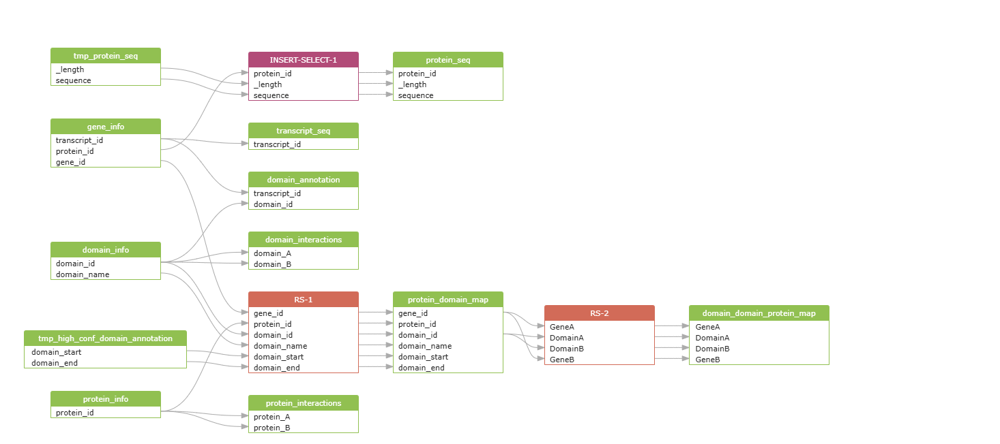

# Surface Protein Interaction Database

- [Surface Protein Interaction Database](#surface-protein-interaction-database)
  - [1. Download and Parse Data](#1-download-and-parse-data)
  - [2. Database initialization](#2-database-initialization)
  - [3. Query optimization](#4-query-optimization)

We have developed the SURFME Interactome DB database inspired by, and based on the work of [Kharaman *et al.* (2020)](https://doi.org/10.1038/s41598-020-71221-5), and their source code shared in their GitHub repository - [CanIsoNet](https://github.com/abxka/CanIsoNet).

# 1. Download and Parse Data

Some of the data, namely the annotation and sequence data of protein-coding isoforms from Ensembl (v103), and the corresponding Pfam domain annotations, were already included in the CTAT genome library, thus these files were not donwloaded again. The rest of the database files were downloaded from the corresponding `ftp://` sites using `wget`, then parsed to a matching tidy, tab-delimited format retaining only the columns of interest.

### [GENCODEv37](https://www.gencodegenes.org/human/release_37.html) - `scripts/prep_gtf.py`

We processed the `.gtf` reference genome annotation from the CTAT genome library folder, using a custom python script, to extract the `transcript_id`, `chromosome`, `start`, `end`, `strand`, `length`, `ttranscript_type`, `protein_id`, `gene_id`, `gene_symbol`, and `hgnc_symbol` fields and parse them into a tab-delimited output file:

```python
def parse_gtf(gtf_file, output_tsv):
    """
    Parses the Ensembl GTF file and extracts transcript ID, chromosome, start, end, strand, length,
    transcript type, protein ID, gene ID, gene symbol, and HGNC symbol.
    """
    try:
        with open(gtf_file, 'r') as infile:
            header_lines = [line for line in infile if line.startswith('#')]
            if not header_lines:
                print("Warning: No header found. Ensure the file is a valid GTF format.")
    except FileNotFoundError:
        print(f"Error: File '{gtf_file}' not found.")
        sys.exit(1)
    except Exception as e:
        print(f"Error reading file: {e}")
        sys.exit(1)

    with open(gtf_file, 'r') as infile, open(output_tsv, 'w') as outfile:
        outfile.write("#transcript_id\tchromosome\tstart\tend\tstrand\tlength\ttranscript_type\tprotein_id\tgene_id\tgene_symbol\thgnc_symbol\n")
        for line in infile:
            if line.startswith('#'):
                continue
            fields = line.strip().split('\t')
            if len(fields) < 9 or fields[2] != 'transcript':
                continue

            chrom, start, end, strand, attributes = fields[0], int(fields[3]), int(fields[4]), fields[6], fields[8]
            length = end - start

            # Dictionary-based attribute extraction
            attr_dict = {}
            for attr in attributes.strip().split(';'):
                if attr.strip() == '':
                    continue
                key, val = attr.strip().split(' ', 1)
                attr_dict[key] = val.strip('"')

            # Required fields (some may be missing)
            gene_id = attr_dict.get("gene_id", "NA").split('.')[0]
            transcript_id = attr_dict.get("transcript_id", "NA").split('.')[0]
            transcript_type = attr_dict.get("transcript_type", "NA")
            protein_id = attr_dict.get("protein_id", "NA").split('.')[0] if "protein_id" in attr_dict else "NA"
            gene_symbol = attr_dict.get("gene_name", "NA")
            hgnc_symbol = attr_dict.get("hgnc_id", "NA").replace("HGNC:", "") if "hgnc_id" in attr_dict else "NA"

            outfile.write(f"{transcript_id}\t{chrom}\t{start}\t{end}\t{strand}\t{length}\t{transcript_type}\t{protein_id}\t{gene_id}\t{gene_symbol}\t{hgnc_symbol}\n")

    print(f"Parsing complete. Output saved to {output_tsv}")


if __name__ == "__main__":
    if len(sys.argv) != 3:
        print("Usage: python parse_gtf.py <input.gtf> <output.tsv>")
        sys.exit(1)

    input_gtf = sys.argv[1]
    output_tsv = sys.argv[2]
    parse_gtf(input_gtf, output_tsv)
```

### [Ensembl (release 103)](https://feb2021.archive.ensembl.org/index.html) - `scripts/prep_fasta.py`
We also processed two multi-line `.fasta` files from reference genome annotation: the `ref_annot.cdna.fa` with the nucleotide sequence of every protein-coding transcript (*= canonical isoforms*), and the `ref_annot.pep` with the amino-acid sequence of canonical proteins. We parsed it too, using another custom python script, to extract the transcript ID, chromosome, start, end, strand, length, transcript type, protein ID, gene ID, gene symbol, and HGNC symbol fields and parse them into a tab-delimited output file with 3 columns `protein_ID/transcript_ID`, `length`, and `sequence`:
```python
#!/usr/bin/env python3
# -*- coding: utf-8 -*-
"""
parse_fasta.py - A script to parse a multi-line FASTA file containing coding sequences into a TSV format.
"""

import sys

def parse_fasta(fasta_file, type, output_tsv):
    """
    Parses a multi-line FASTA file and extracts transcript ID, sequence length, and sequence.
    """
    try:
        with open(fasta_file, 'r') as infile:
            lines = infile.readlines()
            if not lines or not lines[0].startswith('>'):
                print("Error: Invalid FASTA format.")
                sys.exit(1)
    except FileNotFoundError:
        print(f"Error: File '{fasta_file}' not found.")
        sys.exit(1)
    except Exception as e:
        print(f"Error reading file: {e}")
        sys.exit(1)

    with open(fasta_file, 'r') as infile, open(output_tsv, 'w') as outfile:
        if type == "protein":
            outfile.write("protein_ID\tlength\tsequence\n")
        elif type == "transcript":
            outfile.write("transcript_ID\tlength\tsequence\n")
        else:
            print("Error: Type must be either 'protein' or 'transcript'.")
            sys.exit(1)
        
        _id = None
        sequence = []
        
        for line in infile:
            line = line.strip()
            if line.startswith('>'):
                if _id and sequence:
                    seq = ''.join(sequence)
                    outfile.write(f"{_id}\t{len(seq)}\t{seq}\n")
                
                parts = line[1:].split()
                _id = parts[0].split('.')[0] if parts else None
                sequence = []
            else:
                sequence.append(line)
        
        if _id and sequence:  # Write last entry
            seq = ''.join(sequence)
            outfile.write(f"{_id}\t{len(seq)}\t{seq}\n")
    
    print(f"Parsing complete. Output saved to {output_tsv}")


if __name__ == "__main__":
    if len(sys.argv) != 4:
        print("Usage: python parse_fasta.py <input.fasta> <type='protein'/'transcript'> <output.tsv>")
        sys.exit(1)
    
    input_fasta = sys.argv[1]
    type = sys.argv[2]
    output_tsv = sys.argv[3]
    parse_fasta(input_fasta, type, output_tsv)
```

### [Pfam](http://pfam.xfam.org/) - `scripts/parse_pfam.py`

A compressed Pfam annotation is also available in the CTAT genome library, created by running [HMMER](http://hmmer.org/)'s hmmscan on the Ensemble reference fasta file, using the current [Pfam HMM library](https://pfam-docs.readthedocs.io/en/latest/ftp-site.html) for Pfam-A families. This file we moved and decompressed in the desired location then parsed to two separate tabulated files: (i) the **domain_annotation.tsv** file with fields: `transcript_id`, `protein_length`, `domain_id`, `domain_length`, `domain_start`, `domain_end`, `accuracy`, `score`, and `E-value`, and (ii) the **domain_info.tsv** file with columns: `domain_id`, `domain_name`, `description`.
```python
#!/usr/bin/env python3
# -*- coding: utf-8 -*-

import sys
import re

def parse_hmmscan_output(input_file, assoc_output, domain_output):
    domain_seen = {}
    
    with open(input_file, 'r') as infile, \
         open(assoc_output, 'w') as assoc_out, \
         open(domain_output, 'w') as domain_out:
        
        # Headers
        assoc_out.write("transcript_id\tprotein_length\tdomain_id\tdomain_length\tdomain_start\tdomain_end\taccuracy\tscore\tE-value\n")
        domain_out.write("domain_id\tdomain_name\tdescription\n")

        for line in infile:
            if line.startswith('#') or line.strip() == '':
                continue
            
            # Split line into tokens, preserve the final field (description)
            parts = re.split(r'\s{1,}', line.strip(), maxsplit=22)
            if len(parts) < 23:
                continue  # skip malformed lines

            domain_name = parts[0]                 # "target name"
            domain_id = parts[1].split('.')[0]     # "accession"
            domain_length = parts[2]               # "tlen"
            transcript_id = parts[3].split('.')[0] # "query name"
            transcript_length = parts[5]           # "qlen"
            e_value = parts[12]                     # "E-value"
            domain_score = parts[13]               # "(this domain) score"
            hmm_start = parts[15]                  # "(hmm coord) from"
            hmm_end = parts[16]                    # "(hmm coord) to"
            acc = parts[21]                        # "acc"
            description = parts[22]                # "description of target"

             # Write to domain table if not seen
            if domain_id not in domain_seen:
                domain_out.write(f"{domain_id}\t{domain_name}\t{description}\n")
                domain_seen[domain_id] = True

            # Write to association table
            assoc_out.write(f"{transcript_id}\t{transcript_length}\t{domain_id}\t{domain_length}\t{hmm_start}\t{hmm_end}\t{acc}\t{domain_score}\t{e_value}\n")

    print(f"Parsing complete.\n- Transcript-domain associations saved to '{assoc_output}'\n- Unique domain records saved to '{domain_output}'.")

if __name__ == "__main__":
    if len(sys.argv) != 4:
        print("Usage: python parse_domains.py <input_file> <assoc_output.tsv> <domain_output.tsv>")
        sys.exit(1)

    parse_hmmscan_output(sys.argv[1], sys.argv[2], sys.argv[3])
```

### [3DID](https://3did.irbbarcelona.org/download/current/) - `scripts/get_3did.sh`

The database of three-dimensional interacting domains (3did) is a collection of high-resolution three-dimensional structural templates for domain-domain interactions.
```bash
# Set up the URL to the current flat file of 3DID
did_url="https://3did.irbbarcelona.org/download/current/"
# Create directory
output_dir="${output}"
mkdir -p ${output_dir}

# Download the flat file from 3DID containing interacting domain pairs (ID) 
FLAT_3DID="3did_flat.gz"
if [ ! -f "${output_dir}${FLAT_3DID}" ] ; then
	get ${did_url}${FLAT_3DID} ${output_dir} || (echo "Error getting ${FLAT_3DID}" && exit 1)
	gunzip ${output_dir}${FLAT_3DID} || (echo "Error unzipping ${FLAT_3DID}" && exit 1)
    mv ${output_dir}${FLAT_3DID%.gz} ${output_dir}${FLAT_3DID%.gz}.dat
else
	echo "${FLAT_3DID%.gz} have been dowloaded already..."
fi
FLAT_3DID="${output_dir}${FLAT_3DID%.gz}.dat"
echo -e "Downloaded interacting domain pairs: ${FLAT_3DID}"
```
The from the file the physically interacting domains' names are extracted and saved in a tabulated file with two columns: `domain_A`, `domain_B`:
```bash
# Create the interaction table
input_file="${FLAT_3DID}"
preprocessed_file="domain_interactions.tsv"
less "$input_file" | grep "^#=ID" | cut -f4,5 | perl -ane '
	BEGIN { print "domain_A\tdomain_B\n" }
    $F[0] =~ s/.*(PF\d+).*/$1/;
    $F[1] =~ s/.*(PF\d+).*/$1/;
    print "$F[0]\t$F[1]\n$F[1]\t$F[0]\n";
' | sort -u > "${output_dir}/${preprocessed_file}"

echo -e "Processed interactions saved to: ${output_dir}/${preprocessed_file}"
rm ${FLAT_3DID} || (echo "Error removing ${FLAT_3DID}" && exit 1)
```

### [STRING](https://stringdb-downloads.org/download/) - `scripts/get_string.sh`

Two files have been downloaded from STRING db (v12), the **detailed protein links** and the **protein info**. Both of these files were downloaded using `wget`, then parsed using a custom python script. This parser script did not change the localization or number of fields in the data tables, but removed the **'9606.'** tag from the protein IDs on selected columns, so they could have been matched to their Ensembl counterparts.
```python
#!/usr/bin/env python3

import sys

def clean_string_ids(input_file, output_file, columns_to_clean, separator='\t'):
    columns_to_clean = set(map(int, columns_to_clean.split(',')))
    print(f"Cleaning columns: {columns_to_clean}")

    with open(input_file, 'r') as infile, open(output_file, 'w') as outfile:
        header = next(infile) # Read the header line
        outfile.write(header)

        for line in infile:
            fields = line.strip().split(separator)

            for idx in columns_to_clean:
                if idx < len(fields) and fields[idx].startswith('9606.'):
                    fields[idx] = fields[idx].replace('9606.', '', 1)

            outfile.write('\t'.join(fields) + '\n')

    print(f"Cleaned file written to: {output_file}")


if __name__ == '__main__':
    if len(sys.argv) != 5:
        print("Usage: python clean_string_ids.py <input.tsv> <output.tsv> <column_indices> <separator>")
        print("Example: python clean_string_ids.py input.tsv output.tsv 0 '\t'")
        print("         python clean_string_ids.py input.tsv output.tsv 0,2 ' '")
        sys.exit(1)

    input_file = sys.argv[1]
    output_file = sys.argv[2]
    column_indices = sys.argv[3]
    separator = sys.argv[4]

    clean_string_ids(input_file, output_file, column_indices, separator='\t')
```

### [UniProt](https://stringdb-downloads.org/download/) - `scripts/get_uniprot.sh`

The Universal Protein Resource (UniProt), including the UniProt Knowledgebase (UniProtKB) is a
central access point for extensively curated protein information, including function, classification and cross-references. From UniProtKB we downloaded the idmapping data file, however this file containes a lot of unnecessary information, so we filter it using the `scripts/parse_uniprot.py` parser to select only the desired IDs, namely: `UniProtKB-ID`, `Gene_Name`, and `STRING`, facilitating our downstream merging of this data with the protein info table extracted from STRINGdb.
```python
#!/usr/bin/env python3
# -*- coding: utf-8 -*-

"""
parse_uniprot.py - A script to parse the UniprotID mapping .dat file, filtering needed annotations into TSV file output.
"""

import csv
import sys
from collections import defaultdict

def parse_uniprot(input_file, output_file):
    # Structure to hold info by UniProt ID
    uniprot_data = defaultdict(lambda: {"uniprot_name": None, "preferred_name": None, "protein_ids": []})

    # Read the file and collect relevant data
    with open(input_file, "r") as f:
        reader = csv.reader(f, delimiter="\t")
        for row in reader:
            if len(row) < 3:
                continue  # skip malformed lines
            uniprot_id, category, value = row[0], row[1], row[2]

            if category == "UniProtKB-ID":
                uniprot_data[uniprot_id]["uniprot_name"] = value
            elif category == "Gene_Name":
                uniprot_data[uniprot_id]["preferred_name"] = value
            elif category == "STRING":
                cleaned_value = value.removeprefix("9606.")
                uniprot_data[uniprot_id]["protein_ids"].append(cleaned_value)

    # Write to output
    with open(output_file, "w", newline="") as f_out:
        writer = csv.writer(f_out, delimiter="\t")
        writer.writerow(["uniprot_id", "uniprot_name", "protein_id", "preferred_name"])

        for uniprot_id, info in uniprot_data.items():
            for protein_id in info["protein_ids"]:
                writer.writerow([
                    uniprot_id,
                    info["uniprot_name"] or "",
                    protein_id,
                    info["preferred_name"] or ""
                ])

    print(f"Parsing complete. Output saved to {output_file}")

if __name__ == "__main__":    
    if len(sys.argv) != 3:
        print("Usage: python parse_uniprot.py <input_file> <output_file>")
        sys.exit(1)

    input_file = sys.argv[1]
    output_file = sys.argv[2]

    parse_uniprot(input_file, output_file)
```

# 2. Database initialization

